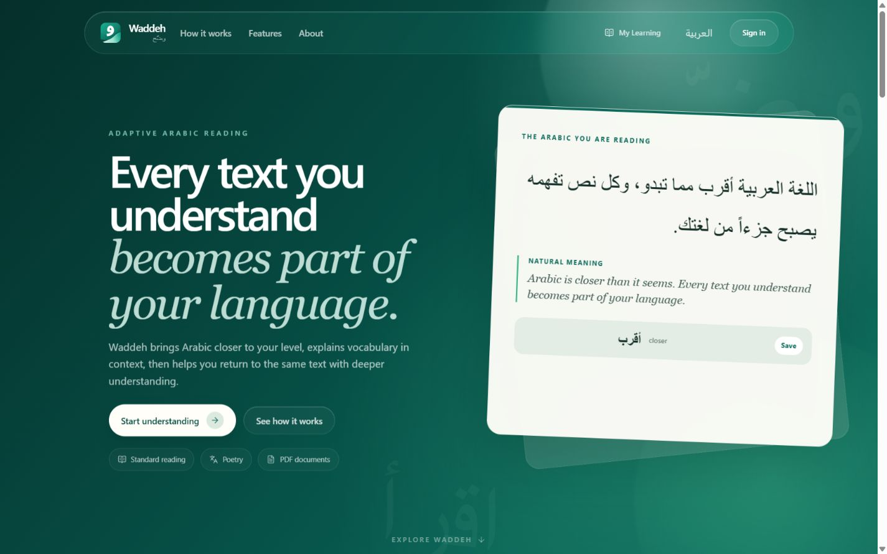
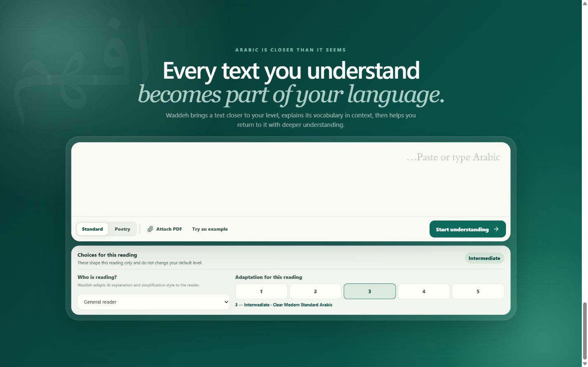
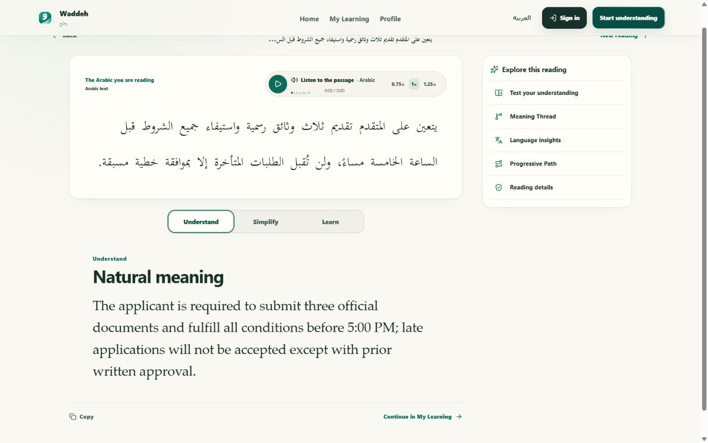
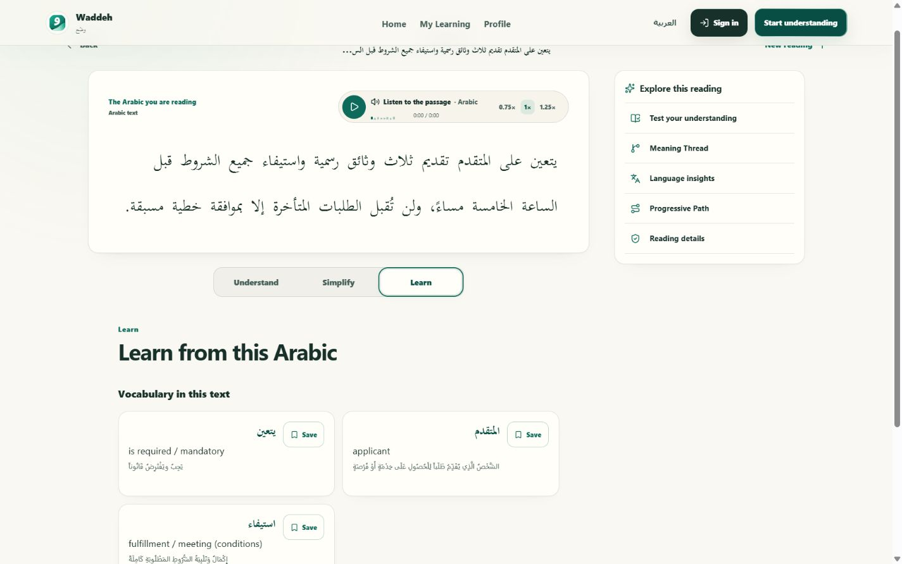
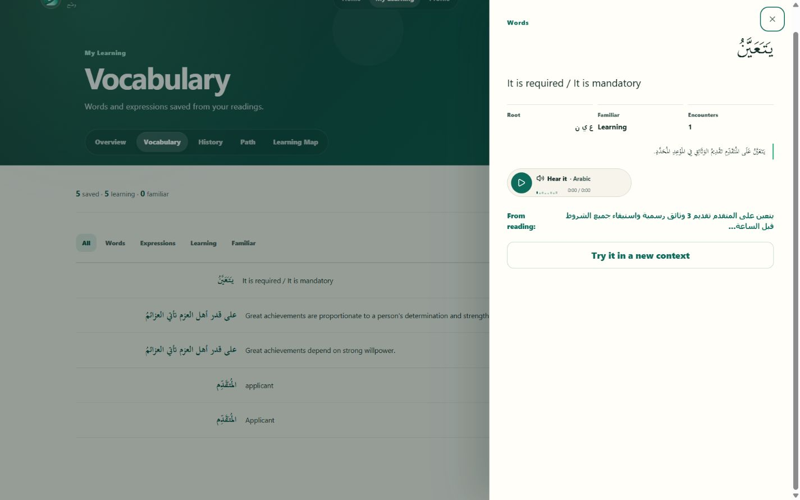
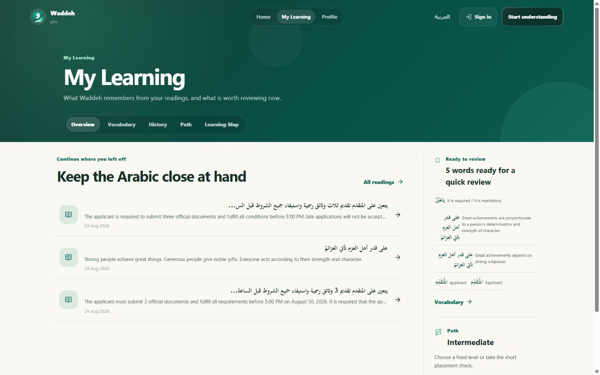

# وضّح | Waddeh

**An adaptive Arabic reading companion that helps learners understand authentic Arabic at their current level and gradually return to the original language with less dependence on translation.**

[](https://github.com/rama-abuawad/Waddeh/actions/workflows/validate.yml)



Waddeh is Arabic-first and built around one progression:

```text
Understand → Simplify → Learn → Return to the original Arabic
```

## Why Waddeh?

Authentic Arabic is often just beyond a learner's current reading level. Translation can reveal the information, but it also removes the need to engage with the Arabic itself. Waddeh keeps the learner inside the language while making the text more approachable.

| Tool category | What it usually optimizes for | What Waddeh does differently |
| --- | --- | --- |
| Translation tools | Replacing Arabic with another language | Uses English only as support and keeps Arabic at the center |
| Generic AI chatbots | Open-ended answers and conversation | Provides a structured, level-aware reading and learning workflow |
| Summarizers | Compressing information | Controls Arabic readability while preserving source meaning and details |
| PDF chat tools | Asking questions about a document | Turns Arabic documents into the same adaptive reading journey as pasted text |

Waddeh is not a generic chatbot, translator, summarizer, or PDF question-answering shell. Its focus is controlled Arabic readability, contextual learning, meaning preservation, and progress toward authentic source language.

## How it works

1. Paste Arabic, open a poem, or attach a PDF.
2. Choose the reader profile and adaptation level for that reading.
3. Read the original Arabic with optional text-to-speech and word-level support.
4. Move between **Understand**, **Simplify**, and **Learn**.
5. Save vocabulary, test comprehension, revisit Meaning Threads, and progress back toward the source wording.



## Understand → Simplify → Learn

- **Understand** presents the natural meaning without making translation the destination.
- **Simplify** adapts Arabic to the selected level while retaining conditions, names, numbers, dates, warnings, and other important facts.
- **Learn** surfaces vocabulary and expressions in context, with diacritics, roots when reliable, examples, saving, review, and transfer practice.





## Core capabilities

### Reading

- Standard Arabic text, poetry explanation, and PDF reading workflows.
- Five adaptation levels, from very clear phrasing to the source as written.
- Reader profiles for a general reader, non-Arabic speaker, or child.
- Original Arabic, natural meaning, controlled simplification, and progressive bridge levels.
- Text-to-speech with playback speed controls.
- PDF validation and reattachment recovery without persisting raw PDF bytes.

### Learning in context

- **Word Lens** for contextual meaning, diacritics, roots, synonyms, and supporting English.
- Saved vocabulary and expressions with review quizzes.
- Transfer challenges that test a saved word in a new context.
- Meaning Threads for actors, references, connectors, conditions, negation, and related sentence relationships.
- Focused comprehension checks and evidence-based progress updates.
- Reading History, Learning Path, and Learning Map.

### Accounts and continuity

- Guest-first, local-first use without an account.
- Firebase Authentication with Google and email/password sign-in.
- Firestore synchronization for signed-in learners.
- Guest-to-account migration that preserves the guest copy and safely merges learning evidence.
- Account-specific local caching and graceful offline or sync-failure behavior.
- Arabic and English interfaces with complete RTL/LTR switching.



## Learning that continues across readings

Waddeh remembers what the learner has saved, reviewed, understood, and asked for help with. Progress displays are based on recorded interactions rather than invented proficiency percentages.



## Architecture

```text
Browser
  Next.js · React · TypeScript · Tailwind CSS · Motion
      │
      ├── Guest/account-specific local cache
      ├── Firebase Authentication
      └── Firestore user-scoped synchronization
      │
      │ structured HTTP requests
      ▼
FastAPI
  Pydantic schemas · input validation · PDF validation
  readability signals · integrity checks · Gemini integration
      │
      ▼
Gemini
  adaptation · poetry · Word Lens · transfer challenges · TTS
```

The browser owns presentation, guest continuity, account state, learning interactions, and user-scoped Firestore synchronization. FastAPI owns validation, AI request structure, Gemini credentials, PDF handling, deterministic analysis, and response schemas.

Raw PDFs remain transient. Firebase Admin is intentionally not required by the backend; guest reading works independently of Firebase Authentication.

## Tech stack

| Layer | Technology |
| --- | --- |
| Frontend | Next.js 16, React 19, TypeScript, Tailwind CSS 4, Motion |
| Backend | FastAPI, Pydantic, Python |
| Accounts | Firebase Authentication |
| Persistence | Firestore with persistent browser caching |
| Language services | Gemini through the FastAPI boundary |
| Validation | ESLint, TypeScript, Pytest, deterministic evaluation fixtures |

## Local setup

### Requirements

- Node.js 20.9 or newer and npm.
- Python 3.11 or newer.
- A Gemini API key for live reading, learning, and TTS requests.
- A Firebase Web App for account and cloud-sync features. Guest mode works without Firebase configuration.

### Install

From the repository root:

```powershell
npm install
python -m venv backend/.venv
backend\.venv\Scripts\python.exe -m pip install -r backend\requirements.txt
```

On macOS or Linux, use `backend/.venv/bin/python` after creating the virtual environment.

### Environment variables

Copy `.env.example` to a local root `.env` for the backend. Keep all real values untracked.

Backend variables:

```text
FRONTEND_ORIGIN=http://localhost:3000
GEMINI_API_KEY=
AI_MODEL=gemini-3.6-flash
AI_FALLBACK_MODEL=gemini-3.5-flash
AI_TTS_MODEL=gemini-3.1-flash-tts-preview
AI_TTS_ARABIC_VOICE=Sulafat
AI_TTS_ENGLISH_VOICE=Sulafat
```

Create `frontend/.env.local` for the frontend:

```text
NEXT_PUBLIC_API_BASE_URL=http://localhost:8000
NEXT_PUBLIC_FIREBASE_API_KEY=
NEXT_PUBLIC_FIREBASE_AUTH_DOMAIN=
NEXT_PUBLIC_FIREBASE_PROJECT_ID=
NEXT_PUBLIC_FIREBASE_STORAGE_BUCKET=
NEXT_PUBLIC_FIREBASE_MESSAGING_SENDER_ID=
NEXT_PUBLIC_FIREBASE_APP_ID=
```

Firebase Web configuration identifies the Firebase project and is not a service-account credential. Never place Gemini keys or Firebase service-account keys in frontend variables.

### Run

Start the backend and frontend in separate terminals:

```powershell
backend\.venv\Scripts\python.exe -m uvicorn app.main:app --app-dir backend --host 127.0.0.1 --port 8000
```

```powershell
npm run dev:frontend
```

Open `http://localhost:3000`.

## Firebase setup

1. Register a Firebase Web App and add its six public Web configuration values to `frontend/.env.local`.
2. Enable Email/Password and Google in Firebase Authentication.
3. Add local and deployed frontend origins to Authentication authorized domains.
4. Create Firestore and deploy the repository rules and indexes:

   ```text
   firebase deploy --only firestore:rules,firestore:indexes
   ```

5. Verify sign-up, verification email, sign-in, reset email, sign-out, guest migration, and second-browser synchronization.

See [Firebase account and persistence architecture](docs/firebase-architecture.md).

For production import settings, environment scope, cost controls, analytics, and
the post-deployment Firebase checklist, follow the [Vercel deployment runbook](documentation/deployment-vercel.md).

## Testing

Run the release validation commands from the repository root:

```powershell
npm run lint:frontend
npm exec --workspace frontend -- tsc --noEmit
npm run build:frontend
backend\.venv\Scripts\python.exe -m pytest backend\tests
backend\.venv\Scripts\python.exe evaluation\check_deterministic.py
git diff --check
```

`evaluation/live_gemini_smoke.py` is an optional live integration check that requires a local Gemini key. It prints safe status summaries and does not print the key.

## Security and privacy

- Gemini credentials stay behind FastAPI and must never enter client code, screenshots, issues, or commits.
- Firestore rules scope account data to the authenticated UID.
- Guest data remains on the current browser; signed-in data uses an account-specific local cache plus Firestore synchronization.
- Uploaded PDF bytes are validated, used for the active request, and never persisted to Firestore.
- Text and document content used for an active request is sent to the configured model provider.
- `.env`, `.env.local`, service-account files, private documents, and user identifiers must never be committed.

See [Security policy](SECURITY.md) and [privacy and security notes](documentation/privacy-security.md).

## Project structure

```text
Waddeh/
├── frontend/                 Next.js application and learning experience
├── backend/                  FastAPI routes, schemas, services, and tests
├── docs/                     Architecture, historical design notes, and assets
│   └── assets/screenshots/   Real product screenshots used by this README
├── documentation/            API, development, evaluation, and privacy notes
├── evaluation/               Deterministic and opt-in live evaluation tools
├── firestore.rules           UID-scoped Firestore security rules
├── firestore.indexes.json    Firestore index definition
├── firebase.json             Firebase deployment configuration
└── .github/                  Validation workflow and contribution templates
```

## Contributing

Contributions are welcome. Read [CONTRIBUTING.md](CONTRIBUTING.md) before opening a pull request and follow the [Code of Conduct](CODE_OF_CONDUCT.md).

See the repository's [contributors](https://github.com/rama-abuawad/Waddeh/graphs/contributors).

## License

The maintainers have not selected an open-source license yet. No license is granted by default; the licensing decision remains separate from this release.
